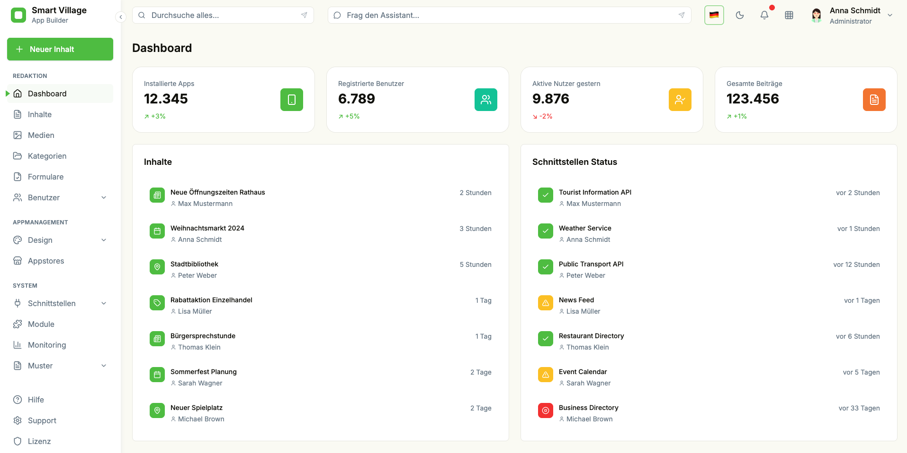

# SVA Studio
[](https://codecov.io/gh/smart-village-solutions/sva-studio)

[](https://github.com/smart-village-solutions/sva-studio/actions/workflows/test-coverage.yml)
[](https://codecov.io/gh/smart-village-solutions/sva-studio)
[](./package.json)
[](./package.json)
[](https://www.typescriptlang.org/)
[](https://nx.dev/)
[](./package.json)



Wir modernisieren das Redaktionssystem der Smart Village App zu einer integrierten Plattform für Content-Management, Benutzerverwaltung, App-Design, Module und Schnittstellen. Fokus: nutzerfreundlich, sicher, erweiterbar.

## Einleitung
SVA Studio soll als Headless- und API-first-System sowohl die App versorgen als auch als Stadt-CMS bzw. Content-Hub für externe Kanäle dienen (Websites, Stelen, Fachsoftware). Schwerpunkt liegt auf strukturierten Inhalten (Presse, Events, POI, Verwaltungsleistungen, Baustellen, Stellenanzeigen), aber auch Sensordaten und anderen typischen Smart City Daten. Ziel ist ein flexibles System, das Inhalte auch in externen Systemen pflegen lässt.

## Hintergrund und Zielsetzung
Das bestehende Redaktionssystem ist umständlich, schwer erweiterbar und limitiert in Konfiguration und UX. SVA Studio adressiert das durch:
- Einfachere tägliche Abläufe für Verwaltung und Engagierte
- Individuelle Gestaltungsmöglichkeiten (Design, Module)
- Modulare Architektur für Erweiterungen
- DSGVO-konforme Datenspeicherung
- Bessere Integration in kommunale Systeme

## Erfolgskriterien
1. Anwender:innen erledigen ihre Arbeit deutlich einfacher, mit verständlicher Doku/Schulungen.
2. Technisch entsteht eine stabile, sichere, erweiterbare Architektur für Module, Schnittstellen, Drittanbieter.
3. Community/Kommunen sind eingebunden und identifizieren sich mit dem Ergebnis.

## Zielgruppen (Auswahl)
- System-Administrator:innen: Stabilität, Sicherheit, Rollen/Rechte, Logging/Monitoring.
- App-Manager:innen: Dashboard, Freigaben, Nutzungsberichte, Rollenvergabe.
- Feature-Manager:innen: Konfigurierbare Module, flexible Schnittstellen, einfache Konfig-UI.
- Designer:innen: Layout/Navigation/Farben anpassen, CD-Support, Vorschau/Test.
- Schnittstellen-Manager:innen: Offene APIs/Standards, Doku, Monitoring der Datenflüsse.
- Redakteur:innen: Einfache Text/Bild-Bearbeitung, Workflows, Versionierung/Archiv.
- Moderator:innen/Support: Nutzerbetreuung, Feedback-Kanäle, einfache Hilfen.
- Inhaltsersteller:innen: Sehr einfache Bedienung, klare Struktur, eingeschränkte Rechte.
- Entscheider:innen: KPI-Dashboards, Kampagnensteuerung, Ressourcen/Budget-Planung.

## Open Source First

**SVA Studio versteht sich als echtes Open-Source-Projekt.** Das bedeutet für uns:

- **Offene Governance:** Transparente Entscheidungsprozesse, Community-Beteiligung bei der Weiterentwicklung
- **Klare Lizenzstrategie:** Favorit ist die [EUPL](https://joinup.ec.europa.eu/collection/eupl/eupl-text-eupl-12) (European Union Public License) – die finale Entscheidung wird in [Issue #2](https://github.com/smart-village-solutions/sva-studio/issues/2) dokumentiert
- **Community-Contributions:** Aktive Einbindung von Entwickler:innen, Designer:innen und Anwender:innen
- **Nachhaltiger Betrieb:** Organisation und Finanzierung über die Förderphase hinaus sicherstellen
- **Standards & Compliance:** IT-Sicherheits-Leitlinie, BSI-Grundschutz, BITV, Föderale IT-Architekturrichtlinien, DSGVO, Open-Source-Vorgaben (MPSC), relevante Datenstandards (xZuFi, OParl, Open311, schema.org, ...)

## Entwicklung: Package Manager

Wir nutzen `pnpm` (Version in `package.json` / `.tool-versions`).

Option A: Corepack (Node.js)
```bash
corepack enable
corepack prepare pnpm@9.12.2 --activate
pnpm install
```
