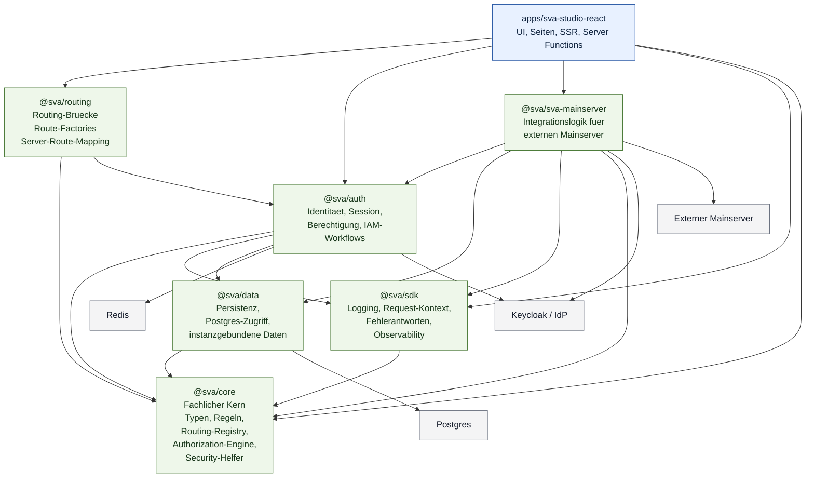

# Übersicht fachlicher Zuständigkeiten

Dieses Diagramm stellt die fachlichen und technischen Verantwortlichkeiten der zentralen Packages dar. Im Unterschied zur Request-Fluss-Sicht steht hier nicht der Ablauf eines einzelnen Requests im Vordergrund, sondern die Frage, welches Package welche Rolle im System übernimmt.

## Mermaid-Diagramm

## Kurzlesart

- `@sva/core` ist der fachliche Kern und liefert die gemeinsamen Regeln, Typen und Kernabstraktionen.
- `@sva/sdk` stellt querschnittliche Infrastruktur bereit, vor allem Logging, Kontext und Observability.
- `@sva/auth` verantwortet Identität, Session und IAM-nahe Fachlogik.
- `@sva/data` kapselt Persistenz und Datenbankzugriff.
- `@sva/sva-mainserver` ist ein spezialisiertes Integrationspaket fuer einen externen Downstream.
- `@sva/routing` verbindet den fachlichen Kern mit der konkreten Routing- und Server-Route-Integration.
- `apps/sva-studio-react` ist die Anwendungsoberflaeche und orchestriert die Nutzung dieser Bausteine.
