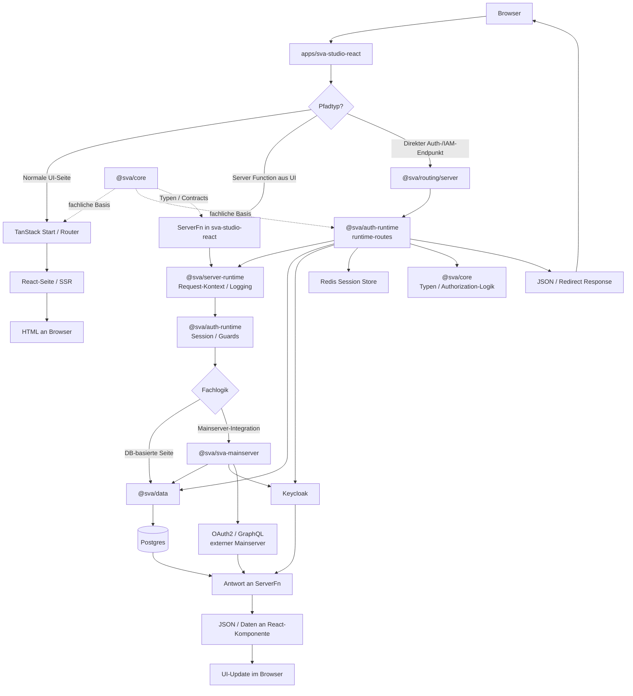

# Übersicht typischer Request-Flüsse

Dieses Dokument zeigt die generischen Laufzeitpfade eines Browser-Requests durch die wichtigsten Packages des Monorepos. Es ergänzt die arc42-Laufzeitsicht um eine kompakte Übersicht für typische Seitenszenarien.

## Mermaid-Diagramm

## Einordnung der Szenarien

### Normale UI-Seite

- `apps/sva-studio-react` rendert die angeforderte Route.
- `@sva/routing/server` wird nur vorgeschaltet geprüft, ob es sich um einen serverseitigen Auth- oder IAM-Pfad handelt.
- Wenn keine zusätzliche Serverlogik benötigt wird, endet der Request mit SSR oder Client-Rendering in der App.

### UI-Seite mit Server Function

- Die Seite wird zunächst normal gerendert.
- Für Datenladen oder Mutationen ruft die React-Komponente eine TanStack-Server-Function auf.
- Diese nutzt typischerweise `@sva/server-runtime` für Kontext und Logging, `@sva/auth-runtime` für Session- und Guard-Prüfung und anschließend fachliche Packages wie `@sva/data`, `@sva/iam-*`, `@sva/instance-registry` oder `@sva/sva-mainserver`.

### Direkter Auth- oder IAM-Endpunkt

- Requests auf Pfade wie `/auth/*`, `/iam/*` oder `/api/v1/iam/*` werden früh von `@sva/routing/server` abgefangen.
- Die eigentliche Bearbeitung liegt dann in `@sva/auth-runtime` und den IAM-Zielpackages.
- `@sva/auth-runtime` spricht je nach Use Case mit Redis, Postgres, Keycloak und der Autorisierungslogik aus `@sva/core`.

### Integrationsszenario mit externem Downstream

- Für Integrationen wie den SVA-Mainserver kapselt `@sva/sva-mainserver` die serverseitige Ablaufkette.
- Das Paket kombiniert instanzgebundene Konfiguration aus `@sva/data`, nutzerbezogene Credentials aus `@sva/auth-runtime` beziehungsweise Keycloak und die externen OAuth2- und GraphQL-Aufrufe.

## Rollen der zentralen Packages

- `apps/sva-studio-react`: Einstiegspunkt für Browser-Requests, Seiten, SSR und Server Functions
- `@sva/routing`: Verteilung zwischen normalem App-Routing und serverseitigen Auth-/IAM-Routen
- `@sva/auth-runtime`: Session, Identität, Runtime-Routen und Auth-Middleware
- `@sva/iam-admin`, `@sva/iam-governance`, `@sva/instance-registry`: IAM-Fachverwaltung, Governance und Instanzlogik
- `@sva/data`: Persistenzzugriff auf Postgres
- `@sva/sva-mainserver`: serverseitige Integrationslogik für den externen Mainserver
- `@sva/server-runtime`: Logging, Request-Kontext, Fehlerantworten und Observability-Helfer
- `@sva/core`: framework-agnostische Typen und fachliche Kernlogik
