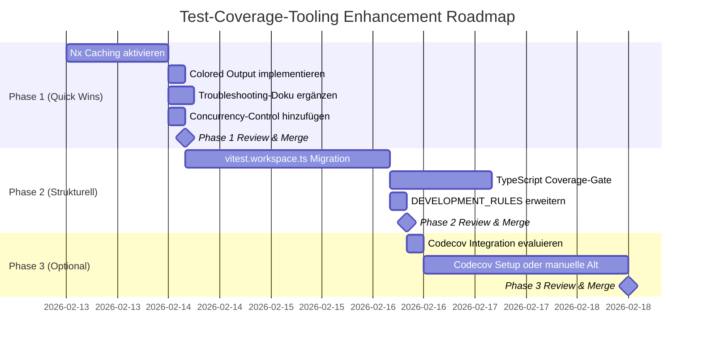

# Implementation Roadmap



## Timeline-Übersicht

| Phase | Tasks | Aufwand | Zeitrahmen | Status |
|-------|-------|---------|-----------|--------|
| **Phase 1** | Nx Cache, Colored Output, Doku, Concurrency | ~2-3h | 13.-14. Feb 2026 | 🟡 Geplant |
| **Phase 2** | Vitest Workspace, TypeScript, Rules | ~4-6h | 17.-19. Feb 2026 | 🟡 Geplant |
| **Phase 3** | Codecov/Summary | ~2-3h | 20.-21. Feb 2026 | 🟡 Optional |

**Total:** 8-12 Stunden über ~9 Arbeitstage

---

## Dependency-Graph

```
Phase 1: Quick Wins (unabhängig)
├─ Nx Caching (nx.json) ────────────────┐
├─ Colored Output (gate-script) ────────┤
├─ Troubleshooting-Doku ────────────────┤
└─ Concurrency (workflow) ──────────────┤
                                        ▼
                               Phase 1 Merge
                                        │
                                        ▼
Phase 2: Strukturell (abhängig von Phase 1)
├─ vitest.workspace.ts ─────────────────┐
│  (benötigt Nx Cache für Testing)      │
├─ TypeScript Gate ─────────────────────┤
│  (nutzt colored output code)          │
└─ DEVELOPMENT_RULES ───────────────────┤
                                        ▼
                               Phase 2 Merge
                                        │
                                        ▼
Phase 3: Visualisierung (optional)
├─ Codecov Setup ───────────────────────┐
│  ODER                                  │
└─ Erweiterte GitHub Summary ───────────┤
                                        ▼
                               Phase 3 Merge
```

---

## Critical Path

**Kritischer Pfad (minimal):**
1. ✅ PR #46 gemerged (Test-Coverage-Governance)
2. 🟡 Phase 1a: Nx Caching (Blocker für alles weitere)
3. 🟡 Phase 1 Merge (Validierung dass Cache funktioniert)
4. 🟡 Phase 2a: vitest.workspace.ts (basiert auf Nx Cache)
5. 🟡 Phase 2 Merge (strukturelle Basis etabliert)

**Alles andere** ist parallel/optional:
- Colored Output, Doku, Concurrency (Phase 1)
- TypeScript Gate, DEVELOPMENT_RULES (Phase 2)
- Codecov/Summary (Phase 3)

---

## PR-Strategie

### Option A: 3 PRs (empfohlen)
```
PR 1: [Phase 1] Quick Wins - Coverage Tooling DX
├─ Nx Caching
├─ Colored Output
├─ Troubleshooting-Doku
└─ Concurrency

PR 2: [Phase 2] Structural Improvements - Coverage Tooling
├─ vitest.workspace.ts
├─ TypeScript Coverage-Gate
└─ DEVELOPMENT_RULES

PR 3: [Phase 3 - Optional] Coverage Visualization
├─ Codecov Integration
└─ Erweiterte GitHub Summary (fallback)
```

**Vorteile:**
- ✅ Klare Separation of Concerns
- ✅ Frühe DX-Gewinne (PR 1)
- ✅ Kleinere Review-Scopes

---

### Option B: 4 PRs (konservativ)
```
PR 1: [Phase 1a] Nx Caching + Concurrency
PR 2: [Phase 1b] Colored Output + Troubleshooting-Doku
PR 3: [Phase 2] Vitest Workspace + TypeScript Gate
PR 4: [Phase 3] Codecov/Summary
```

**Vorteile:**
- ✅ Minimal Risk per PR
- ✅ Inkrementelles Feedback

**Nachteil:**
- ⚠️ Mehr PR-Overhead (Reviews, CI-Runs)

---

## Rollout-Checkpoints

### Checkpoint 1: Nach Phase 1 PR
**Kriterien:**
- ✅ Nx Cache funktioniert (verified via `nx show project --verbose`)
- ✅ Coverage-Runs zeigen Cache-Hits
- ✅ Colored Output in CI sichtbar
- ✅ Troubleshooting-Doku ist zugänglich

**Go/No-Go:** Wenn Nx Cache nicht stabil → Phase 2 verschieben

---

### Checkpoint 2: Nach Phase 2 PR
**Kriterien:**
- ✅ vitest.workspace.ts ist live
- ✅ TypeScript Coverage-Gate läuft in CI
- ✅ DEVELOPMENT_RULES sind aktualisiert
- ✅ Mind. 2 Packages nutzen neue Workspace-Config

**Go/No-Go:** Wenn TypeScript-Probleme → Rollback zu .mjs

---

### Checkpoint 3: Nach Phase 3 PR (optional)
**Kriterien:**
- ✅ Codecov/Summary zeigt Daten
- ✅ PR-Kommentare/Summary funktionieren
- ✅ Team findet Visualisierung nützlich

**Go/No-Go:** Wenn nicht nützlich → Feature optional lassen

---

## Success Metrics (KPIs)

Nach vollständiger Implementation (4 Wochen nach Phase 3):

| Metrik | Baseline (jetzt) | Ziel (nach Enhancements) | Messung |
|--------|------------------|--------------------------|---------|
| **Coverage-Run (affected)** | ~60s | ~18s (70% Cache-Hit) | CI-Logs |
| **Coverage-Run (full)** | ~120s | ~60s (50% Cache-Hit) | CI-Logs |
| **Support-Anfragen** | ~5/Woche | ~2/Woche | Issue-Tracker |
| **Package-Migration-Zeit** | ~15min | <5min | Developer-Survey |
| **Coverage-Trend-Sichtbarkeit** | ❌ Nicht vorhanden | ✅ In Codecov/PRs | Codecov/Summary |

**Review-Termin:** 2026-03-15 (4 Wochen nach Phase 3)

---

## Team-Capacity

**Benötigt:**
- 1 Developer (primary implementer): ~8-12h
- 1 Reviewer (Code-Reviews): ~2-3h
- Team (Testing & Feedback): ~1h

**Total Team-Investment:** ~11-16h

**Verfügbarkeit prüfen:**
- [ ] Primary Developer hat Capacity (2 Wochen)
- [ ] Reviewer verfügbar (Reviews innerhalb 24h)
- [ ] Team kann Testing unterstützen (je 15min/Phase)

---

## Communication Plan

| Stakeholder | Nachricht | Kanal | Timing |
|-------------|-----------|-------|--------|
| **Dev-Team** | "New Coverage-Tooling enhancements planned" | Slack #dev | Vor PR 1 |
| **Tech Lead** | Proposal PDF + Executive Summary | Email | Jetzt |
| **QA/DevOps** | Impact auf CI-Workflows | Meeting | Vor PR 1 |
| **Dev-Team** | "Phase 1 live - try new cache!" | Slack #dev | Nach PR 1 merge |
| **Dev-Team** | "Update your vitest configs - guide linked" | Slack #dev | Nach PR 2 merge |
| **All** | Retro: Lessons learned + metrics | Wiki/Notion | Nach 4 Wochen |

---

## Contacts & Ownership

**Proposal Owner:** Custom Agent Review (GitHub Copilot)  
**Implementation Lead:** TBD (nach Approval)  
**Reviewer(s):** TBD (mindestens 1 Senior Dev)  
**Approval Authority:** Tech Lead + 1 weiterer Dev

**Questions?** → Siehe [proposal.md](./proposal.md) oder ask in #dev-coverage

---

**Last Updated:** 2026-02-12  
**Next Review:** 2026-02-15 (Team-Meeting)
